<p align="center">
  <strong>🌐 언어 선택 / 言語選択</strong><br>
  <a href="#ko">한국어</a> · <a href="#ja">日本語</a>
</p>

---

<p align="center">
  
  
  
</p>

<p align="center">
  <h1 align="center">⚔️ Rogue01</h1>
  <p align="center"><i>턴제 로그라이크 · ターン制ローグライク</i></p>
</p>

<p align="center">
  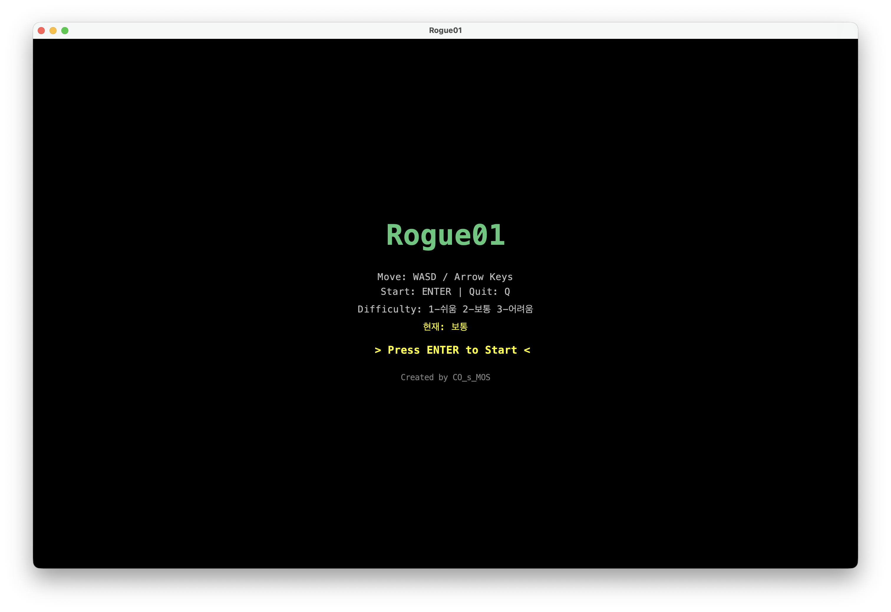
</p>

<p align="center">
  <sub>Java로 만든 던전 탐험 × JRPG 전투 · Javaで作るダンジョン探索×JRPG戦闘</sub>
</p>

---

<a id="ko"></a>

<details open>
<summary><strong>🇰🇷 한국어</strong></summary>

## 🇰🇷 한국어

### 📑 목차

- [소개](#-소개)
- [스크린샷](#-스크린샷)
- [주요 기능](#-주요-기능)
- [스테이지 구조](#-스테이지-구조)
- [조작법](#-조작법)
- [실행 방법](#-실행-방법)
- [프로젝트 구조](#-프로젝트-구조)

---

### 📖 소개

**Rogue01**은 Java로 제작된 **턴제 로그라이크** 게임입니다.

> 🗡️ 던전을 탐험하고, 적과 맞서 싸우며, 장비를 모아 챕터 보스까지 도달하세요.  
> 3챕터 × 3레벨 구조에 **JRPG 스타일 전투**, **보스방**, **봉인된 계단**이 어우러진 클래식한 한 화면 로그라이크입니다.

| 구분       | 내용                       |
| ---------- | -------------------------- |
| **장르**   | 턴제 로그라이크, JRPG 전투 |
| **플랫폼** | Java (Swing)               |
| **개발**   | CO_s_MOS                   |

---

### 🖼️ 스크린샷

<details>
<summary><strong>📷 스크린샷 보기 (클릭하여 펼치기)</strong></summary>

| | |
|:---:|:---:|
|  | 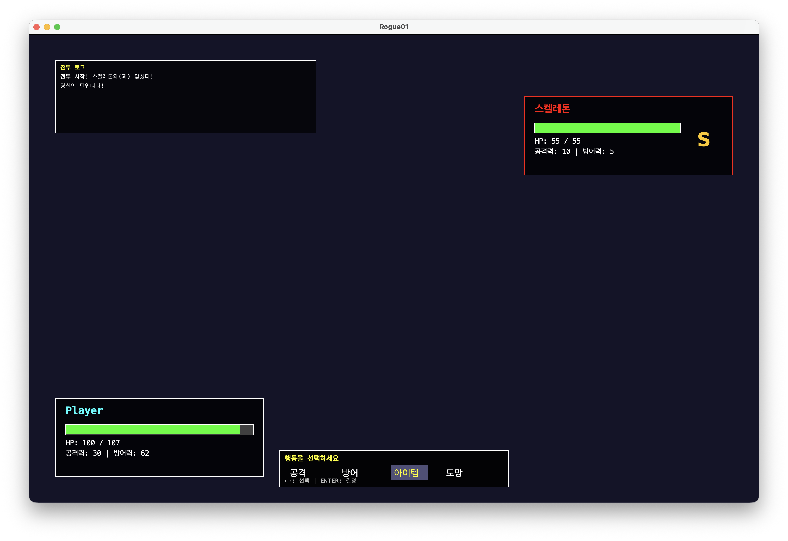 |
| **메인 메뉴** · 난이도 선택 | **전투** · JRPG 스타일 |
| 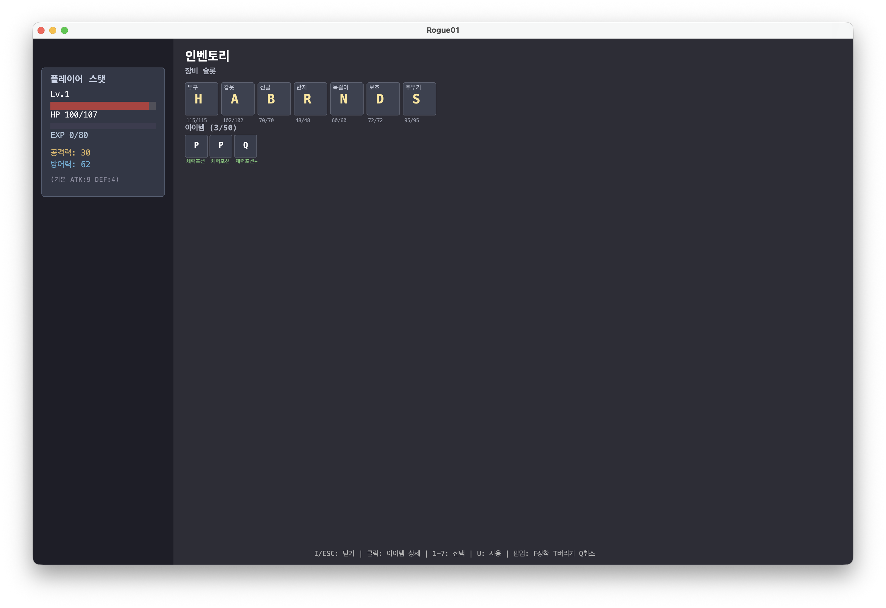 | 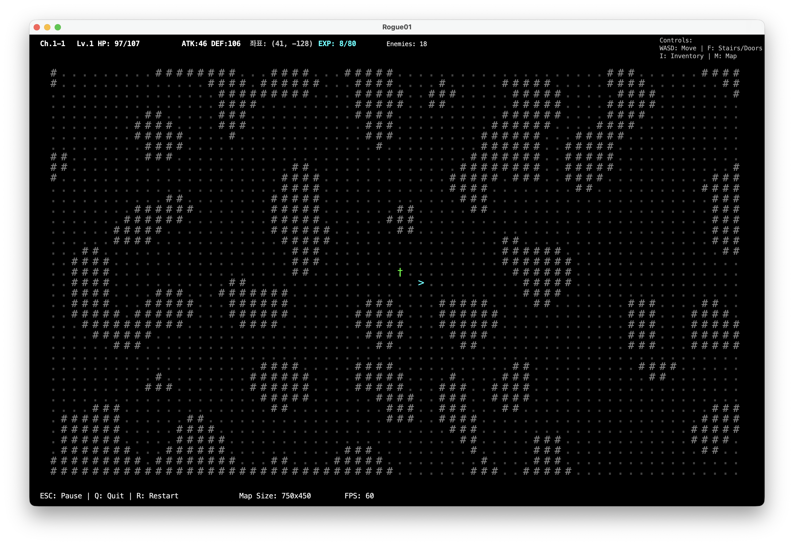 |
| **인벤토리** · 장비·아이템 | **계단** · 다음 층 진입 |
| 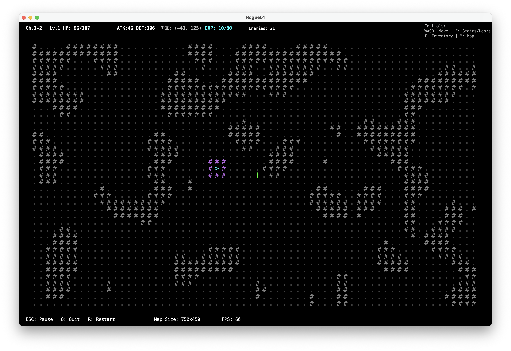 | 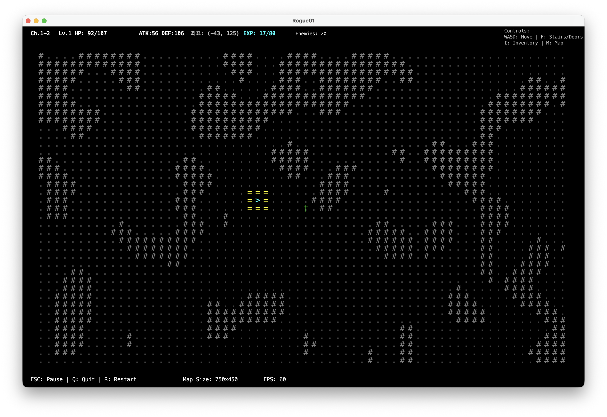 |
| **2층** · 봉인된 계단 | **봉인 해제** · 중간보스 처치 후 |
| 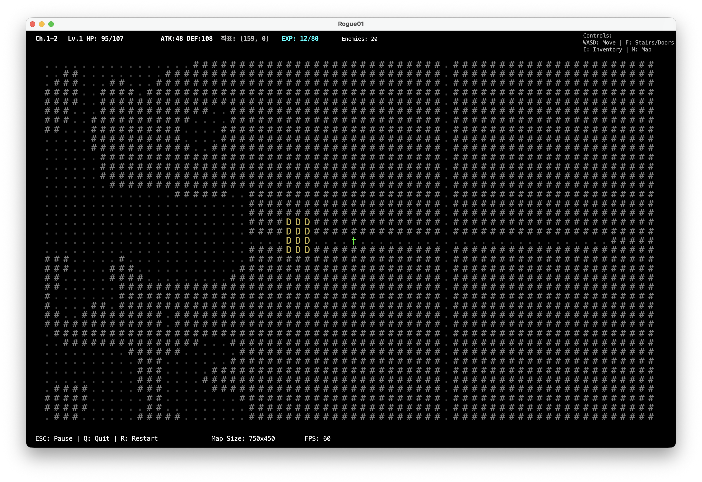 | 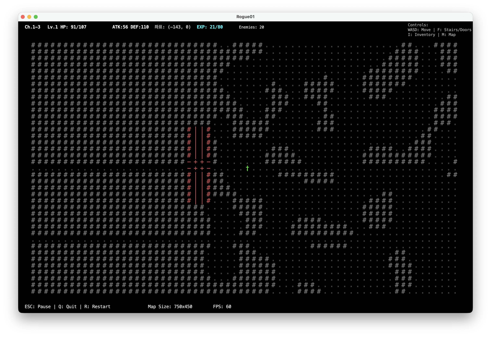 |
| **중간보스방 문** · 3×4 | **챕터 보스방 문** · 4×12 역십자가 |
| 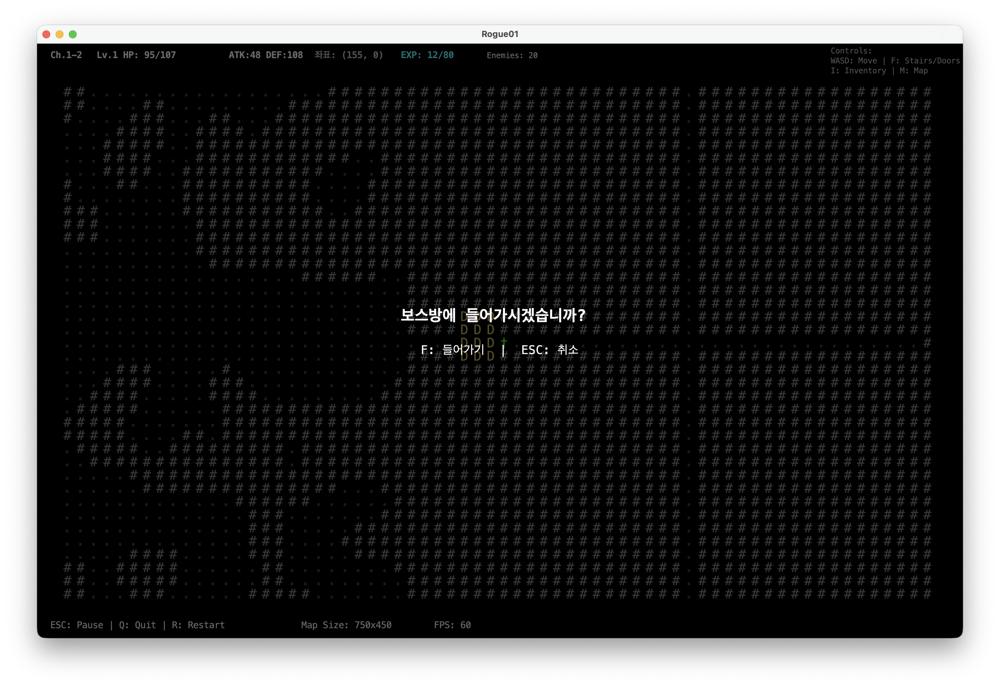 | 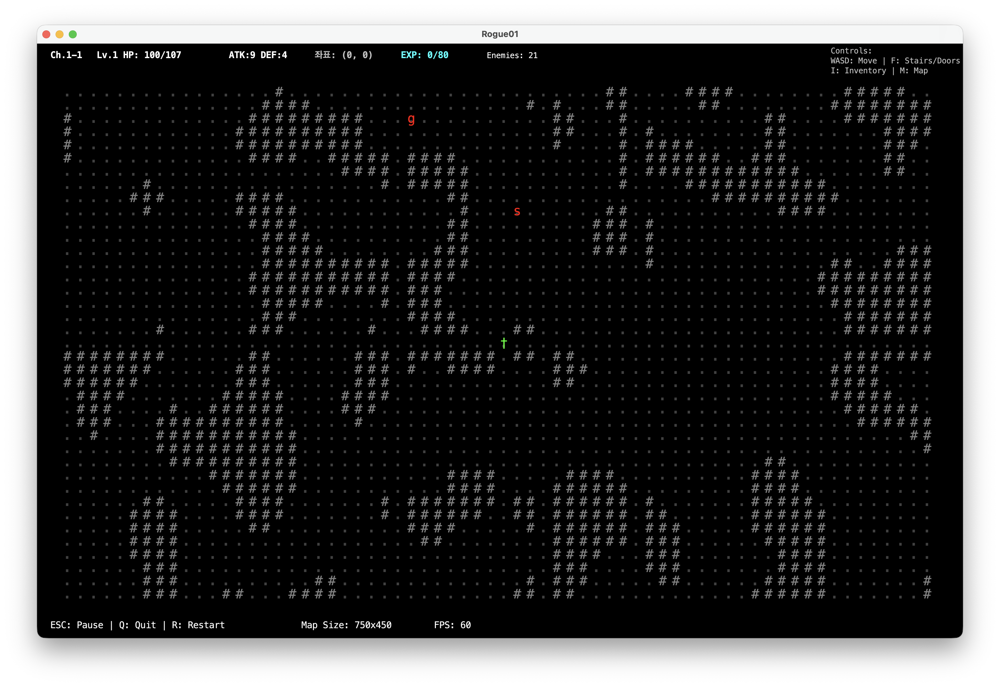 |
| **문 상호작용** · F키 진입 선택 | **맵 뷰** · M키 |
| 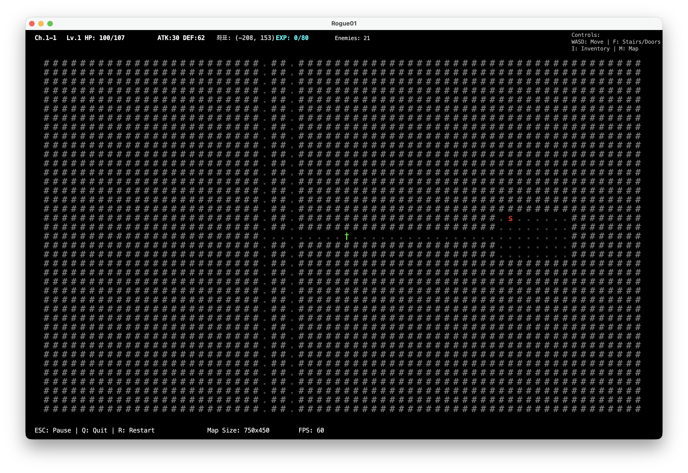 | 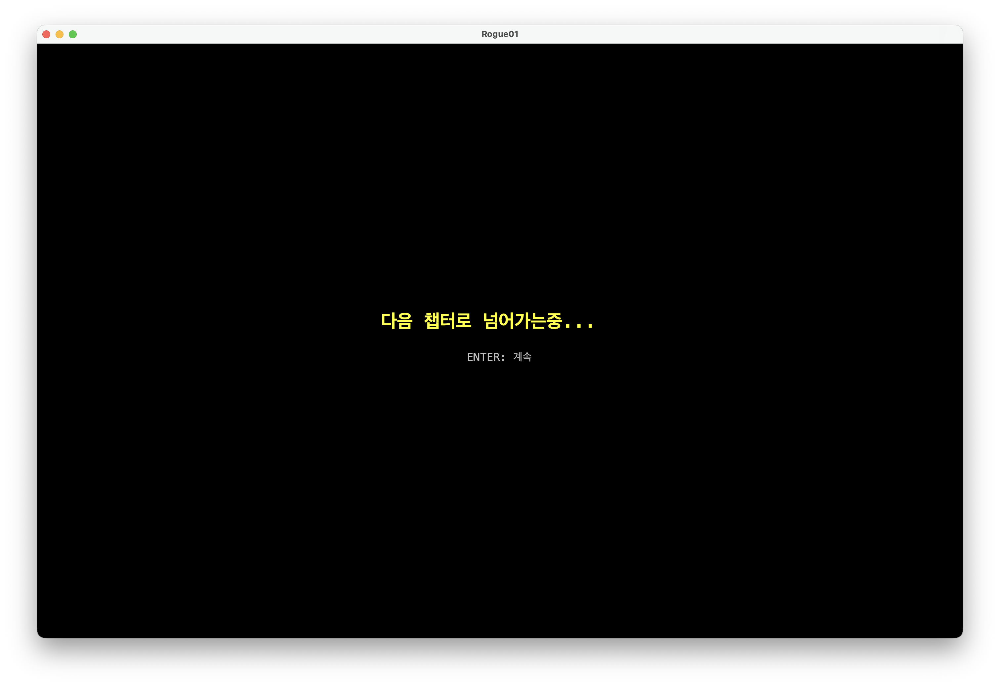 |
| **맵 뷰** · 범례(계단·보스방) | **챕터 전환** · 보스 처치 후 |

</details>

---

### ✨ 주요 기능

| 카테고리         | 설명                                                                |
| ---------------- | ------------------------------------------------------------------- |
| 🗺️ **턴제 맵**   | WASD 이동, Space 턴 넘기기. 적과 같은 칸에 들어가면 전투 시작       |
| ⚔️ **JRPG 전투** | 공격·방어·아이템·도망. 크리티컬 히트, 전투 로그                     |
| 🏰 **스테이지**  | 3챕터 × 3레벨 (1층→2층→3층). 계단(>), 봉인벽, 무너진 벽             |
| 🚪 **보스방**    | 2층 중간보스(Troll) 2개, 3층 챕터보스(Dragon). 문 앞 **F키**로 진입 |
| 🛡️ **장비**      | 무기·방어구 레벨 1~9. 인벤토리, 착용/해제, 드롭                     |
| 📊 **난이도**    | 쉬움 / 보통 / 어려움 (메뉴 1·2·3)                                   |

---

### 🗂️ 스테이지 구조

```
챕터 1  ──►  1-1 → 1-2 → 1-3(보스) ──► 챕터 2
챕터 2  ──►  2-1 → 2-2 → 2-3(보스) ──► 챕터 3
챕터 3  ──►  3-1 → 3-2 → 3-3(최종보스) ──► 🏆 게임 클리어
```

- **1층**: 일반 몬스터. **계단(>)** 찾아서 F키로 2층 진입
- **2층**: 강한 몬스터 + **중간보스방 2개**. 중간보스 1마리 처치 시 계단 봉인 해제
- **3층**: 더 강한 몬스터 + **챕터 보스방**. 보스 처치 시 다음 챕터 또는 게임 클리어

---

### ⌨️ 조작법

|        키         | 동작                 |
| :---------------: | -------------------- |
| **WASD** / 방향키 | 이동                 |
|     **Space**     | 턴 넘기기            |
|       **F**       | 계단·보스방 상호작용 |
|       **I**       | 인벤토리             |
|       **M**       | 맵 뷰                |
|      **ESC**      | 일시정지             |

---

### 🚀 실행 방법

**요구사항**: JDK 21

```bash
# 클론 후
cd Rogue01

# 빌드
mvn clean package

# 실행
java -jar target/rogue-game-1.0.0.jar
```

IDE에서 실행할 경우 **실행 클래스**: `com.rogue01.Main`

---

### 📁 프로젝트 구조

```
src/main/java/com/rogue01/
├── Main.java              # 엔트리 포인트
├── game/                   # Game, GameLoop, InputManager, GameBalance
├── entity/                 # Player, Enemy, EnemyType
├── map/                    # Map, Tile, generators (Hybrid, BSP, Cellular...)
├── item/                   # Item, Weapon, Armor, Inventory, ItemFactory
├── battle/                 # BattleManager, BattleScreen
└── ui/                     # GameWindow, GamePanel
```

---

### 👤 제작

**Created by CO_s_MOS**

</details>

---

<a id="ja"></a>

<details>
<summary><strong>🇯🇵 日本語</strong></summary>

## 🇯🇵 日本語

### 📑 目次

- [紹介](#-紹介)
- [スクリーンショット](#-スクリーンショット)
- [主な機能](#-主な機能)
- [ステージ構成](#-ステージ構成)
- [操作](#-操作)
- [実行方法](#-実行方法)
- [プロジェクト構成](#-プロジェクト構成)

---

### 📖 紹介

**Rogue01**は Java で制作された **ターン制ローグライク** ゲームです。

> 🗡️ ダンジョンを探索し、敵と戦い、装備を集めてチャプターボスまで到達しましょう。  
> 3チャプター×3レベル構成に **JRPGスタイルの戦闘**・**ボス部屋**・**封印された階段** が組み合わされた、クラシックなワン画面ローグライクです。

| 項目                 | 内容                           |
| -------------------- | ------------------------------ |
| **ジャンル**         | ターン制ローグライク、JRPG戦闘 |
| **プラットフォーム** | Java (Swing)                   |
| **開発**             | CO_s_MOS                       |

---

### 🖼️ スクリーンショット

<details>
<summary><strong>📷 スクリーンショットを見る（クリックで展開）</strong></summary>

| | |
|:---:|:---:|
|  |  |
| **メインメニュー** · 難易度選択 | **戦闘** · JRPGスタイル |
|  |  |
| **インベントリ** · 装備・アイテム | **階段** · 次の階へ |
|  |  |
| **2階** · 封印された階段 | **封印解除** · 中ボス撃破後 |
|  |  |
| **中ボス部屋の扉** · 3×4 | **チャプターボス部屋の扉** · 4×12逆十字 |
|  |  |
| **扉操作** · Fキーで進入選択 | **マップビュー** · Mキー |
|  |  |
| **マップビュー** · 凡例（階段・ボス部屋） | **チャプター遷移** · ボス撃破後 |

</details>

---

### ✨ 主な機能

| カテゴリ              | 説明                                                                    |
| --------------------- | ----------------------------------------------------------------------- |
| 🗺️ **ターン制マップ** | WASD移動、Spaceでターン進行。敵と同じマスに入ると戦闘開始               |
| ⚔️ **JRPG戦闘**       | 攻撃・防御・アイテム・逃走。クリティカルヒット、戦闘ログ                |
| 🏰 **ステージ**       | 3チャプター×3レベル（1階→2階→3階）。階段(>)、封印壁、崩れた壁           |
| 🚪 **ボス部屋**       | 2階中ボス(Troll)2体、3階チャプターボス(Dragon)。扉前で **Fキー** で進入 |
| 🛡️ **装備**           | 武器・防具レベル1~9。インベントリ、装備/解除、ドロップ                  |
| 📊 **難易度**         | 簡単 / 普通 / 難しい（メニュー1・2・3）                                 |

---

### 🗂️ ステージ構成

```
チャプター1  ──►  1-1 → 1-2 → 1-3(ボス) ──► チャプター2
チャプター2  ──►  2-1 → 2-2 → 2-3(ボス) ──► チャプター3
チャプター3  ──►  3-1 → 3-2 → 3-3(ラスボス) ──► 🏆 ゲームクリア
```

- **1階**: 通常モンスター。**階段(>)** を探してFキーで2階へ
- **2階**: 強いモンスター + **中ボス部屋2つ**。中ボス1体撃破で階段の封印解除
- **3階**: さらに強いモンスター + **チャプターボス部屋**。ボス撃破で次チャプターまたはゲームクリア

---

### ⌨️ 操作

|        キー         | 動作                 |
| :-----------------: | -------------------- |
| **WASD** / 方向キー | 移動                 |
|      **Space**      | ターン進行           |
|        **F**        | 階段・ボス部屋の操作 |
|        **I**        | インベントリ         |
|        **M**        | マップビュー         |
|       **ESC**       | 一時停止             |

---

### 🚀 実行方法

**必要環境**: JDK 21

```bash
# クローン後
cd Rogue01

# ビルド
mvn clean package

# 実行
java -jar target/rogue-game-1.0.0.jar
```

IDE で実行する場合の **メインクラス**: `com.rogue01.Main`

---

### 📁 プロジェクト構成

```
src/main/java/com/rogue01/
├── Main.java              # エントリポイント
├── game/                   # Game, GameLoop, InputManager, GameBalance
├── entity/                 # Player, Enemy, EnemyType
├── map/                    # Map, Tile, generators (Hybrid, BSP, Cellular...)
├── item/                   # Item, Weapon, Armor, Inventory, ItemFactory
├── battle/                 # BattleManager, BattleScreen
└── ui/                     # GameWindow, GamePanel
```

---

### 👤 クレジット

**Created by CO_s_MOS**

</details>

---

<p align="center">
  <sub>Rogue01 · Java Roguelike · CO_s_MOS</sub>
</p>
